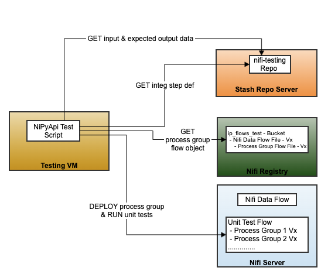
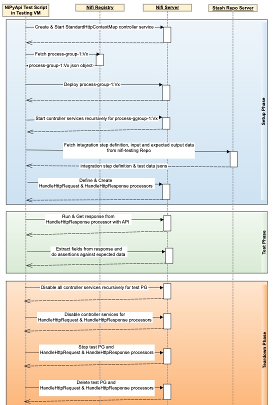
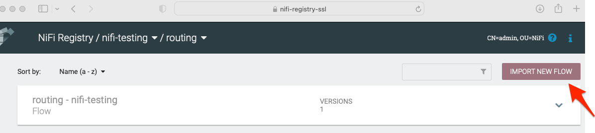

### Nifi Flow Unit Testing
 <br/>


This is for Nifi Flow Unit Testing Framework and Tests
#### Documentation
* [NiPyApi - A Python Client SDK for Apache NiFi](https://nipyapi.readthedocs.io/en/latest/index.html)
### Developer Guide
#### Local Development
Below are the steps for local setup to develop flow unit tests in python and run on Nifi Server and Nifi Registry running in docker containers.  
* Install
    * Python 3.11, PIP, NiPyApi & ODBC Driver and MS SQL Tools
        * Mac (Terminal):
          ```
          brew install python@3.11 unixodbc
          /bin/bash -c "$(curl -fsSL https://raw.githubusercontent.com/Homebrew/install/master/install.sh)"
          brew tap microsoft/mssql-release https://github.com/Microsoft/homebrew-mssql-release
          brew update
          HOMEBREW_ACCEPT_EULA=Y
          brew install msodbcsql17 mssql-tools
          ```
        * Windows (PowerShell as admin)
            * Install [Chocolatey](https://chocolatey.org/install)
            * Install Python, ODBC Driver and MS SQL Tools
              ```
              choco install python sqlserver-odbcdriver sql-server-management-studio
              ```
        * Any Operating System 
         ```
          curl https://bootstrap.pypa.io/get-pip.py -o get-pip.py
          python3 get-pip.py
          pip3 install nipyapi pytest jsonpath_ng gitpython repo python-dotenv jproperties itertools hvac python-dateutil psycopg2-binary pyodbc
         ```
	* [Docker Desktop](https://www.docker.com/products/docker-desktop)
* Run & Configure
    * Nifi custom process nar file needs to be copied to docker/nifi-extensions folder whenever there is any update. 
      
      *Note: Temporarily, until certs are added to vault, one has to modify the VaultTransitClient.java with an additional header: (X-Vault-Token)*  
  ```       
      requestBuilder.header(X_VAULT_REQUEST, "true");
      requestBuilder.header("X-Vault-Token", "00000000-0000-0000-0000-000000000000");
  ```

    * Start Nifi, Nifi Registry & Vault in Docker containers 
        ```
         cd docker
         docker-compose up -d
        ``` 

#### Run Flow Unit Tests
* Add Nifi self-signed certificates to KeyChain (Mac) or "Local Machine Certificate Store" (Windows), we have 2 options here
  * Option-1: Add pre-generated certificates from repo
    * Open "KeyChain Access"
    * Drag and Drop certificate - 'docker/nifi-certs/nifi-cert.pem' into KeyChain
    * Import the NiFi certs to keychain and mark it as trusted
  * Option-2: Generate certificates and add to KeyChain
    * Download Apache Nifi Toolkit https://nifi.apache.org/download.html and extract
        ```
         tar -xvzf nifi-toolkit-1.15.3-bin.tar.gz
         cd nifi-toolkit-1.15.3
        ```
    * Generate the SSL certificates
      ```
       ./bin/tls-toolkit.sh standalone -n nifi -C 'CN=admin,OU=NiFi' --subjectAlternativeNames '0.0.0.0,nifi,nifiserver1,nifiserver2,nifiserver3,nifiserver4,nifi-regsitry,nifi-registry-ssl,nifi-registry-server'
      ```
      The above command generates the certificate, key, keystore, truststore, and the properties file for a NiFi server deployed in localhost, please note subjectAlternativeNames must include both Nifi server name and Nifi registry server name if you are using SSL for both Nifi and Nifi Registry
    * Copy above files to 'docker/nifi-certs'
      ```
       export NIFI_CERTS={path-for-nifi-testing-repo}/docker/nifi-certs
       export NIFI_TOOLKIT={path-for-nifi-toolkit}
       cp $NIFI_TOOLKIT/localhost/keystore.jks $NIFI_CERTS/
       cp $NIFI_TOOLKIT/localhost/truststore.jks $NIFI_CERTS
       cp $NIFI_TOOLKIT/localhost/nifi-cert.pem $NIFI_CERTS
       cp $NIFI_TOOLKIT/localhost/nifi-key.key $NIFI_CERTS
      ```
      _**Note:**_ Replace {path-for-nifi-testing-repo} and {path-for-nifi-toolkit} with actual paths
* Add 'nifi' host running in docker to your local hosts file
  * sudo sh -c "echo 127.0.0.1 nifi >> /etc/hosts"
* If you are using SSL for both Nifi and Nifi Registry do below steps -
  * sudo sh -c "echo 127.0.0.1 nifi-registry-ssl >> /etc/hosts"
  * Go to nifi-testing/docker/nifi-certs folder
  * Open "CN=admin_OU=NiFi.password" and copy password
  * Open "CN=admin_OU=NiFi.p12" and paste password
  * In Nifi Registry UI
    * Create a user same as Subject name of your nifi certificate - "CN=nifi, OU=NIFI"
    * Grant below permissions to the user
      * Can manage buckets - Read / Write / Delete
      * Can proxy user requests - Read / Write / Delete
      * Bucket - Read / Write
    * Create bucket if not exists - "nifi-testing"
    * Import sample routing flow from docker/nifi-flows/routing.json into the Nifi Registry
      * NiFi Registry Import URL: https://<local-nifi-registry-ssl-hostname:port>/nifi-registry/#/explorer/grid-list
      * 
    * Update flow_version_mapping (routing version) in test.properties to match the local NiFi Registry Flow version (Refer above screenshot for versions)  

* Run Nifi Flow python test script
    ```
     cd src
     py flow_unit_test.py
    ``` 
    
    

## Additional settings for test files

Any of the following fields can be added to the 'settings' section of the test files
```
"settings": {
    "load_file_type": "binary",
    "skip_replace_text_in": "true",
    "skip_check_out_content": "true",
    "subprocess": {
        "before": "docker cp ../test-data/tc1.txt nifi:/opt/nifi/simple.txt\"",
        "after": "docker exec nifi rm /opt/nifi/simple.txt"
    }
}

```
- load_file_type: binary or text (default is text). specifies the mode the '$.input.flow_content.file_name' should be read from the disk
- skip_replace_text_in: if true, the replace text in processor is skipped
- skip_check_out_content: if true, the output content is not verified against '$.output.flow_content.file_name'
   


